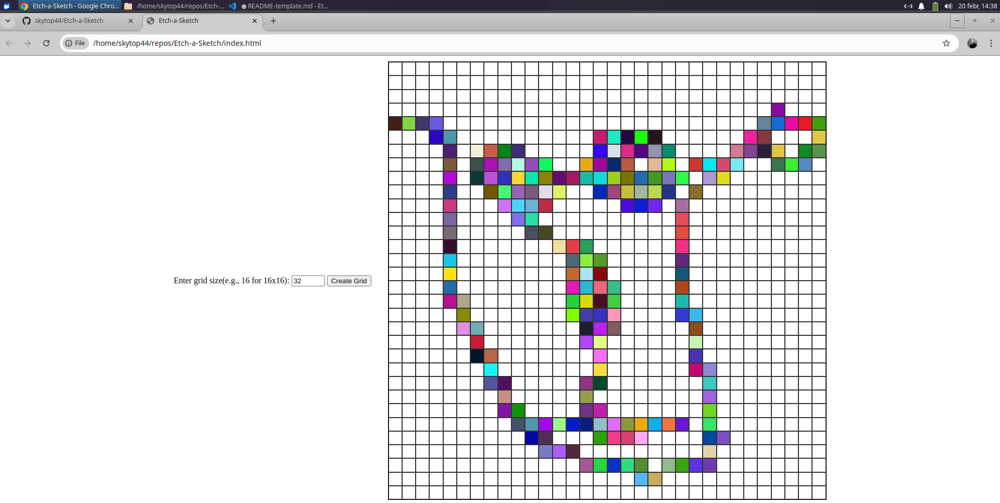

## Table of contents

- [Overview](#overview)
  - [The challenge](#the-challenge)
  - [Screenshot](#screenshot)
  - [Links](#links)
- [My process](#my-process)
  - [Built with](#built-with)
- [Author](#author)

## Overview

### The challenge

Build a browser version of something between a sketchpad and an Etch-A-Sketch.

### Screenshot

### Links

- Solution URL: [link](https://github.com/skytop44/Etch-a-Sketch)
- Live Site URL: [link](https://skytop44.github.io/Etch-a-Sketch/)

## My process

### Built with

- Semantic HTML5 markup
- CSS custom properties
- Flexbox
- Javascript

## Author

- Website - [Add your name here](https://github.com/skytop44)
